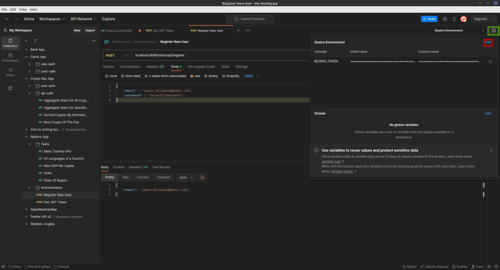
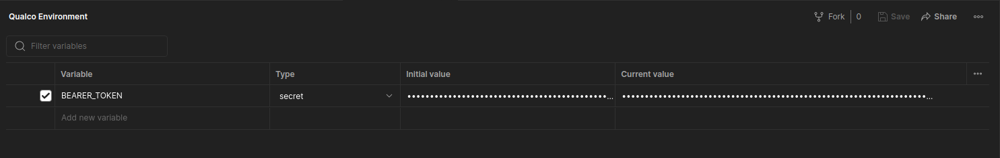
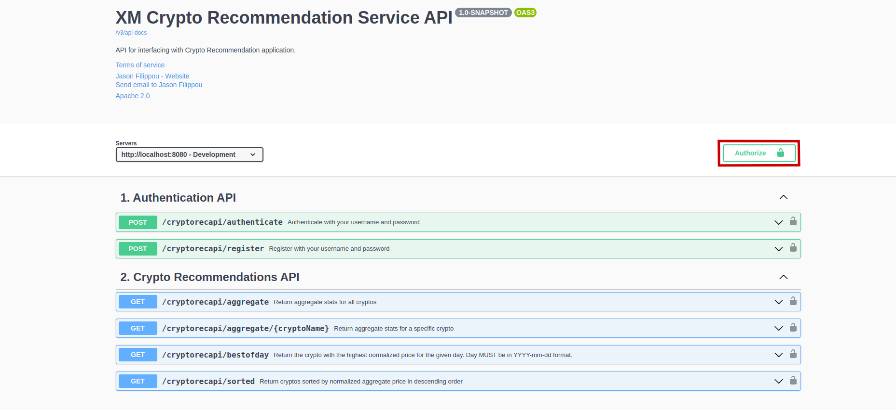
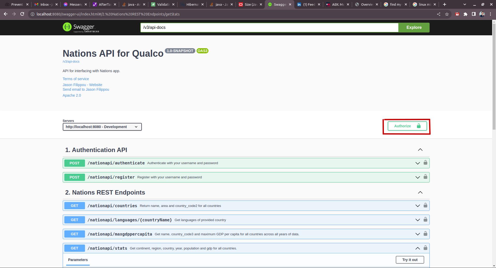

# README

# Table of Contents

1. [Getting Started](#getting-started)
   1. [Database](#database-)
   2. [Interacting with the API](#interacting-with-the-api)
      1. [Postman](#postman-)
      2. [OpenAPI](#openapi-)
   3. [User Registration & Authentication](#user-registration--authentication)
2. [Addressing writeup requirements](#addressing-requirements-from-writeup)
   1. [Task 1(a)](#task-1a)
   2. [Task 1(b)](#task-1b)
   3. [Task 2](#task-2)
   4. [Task 3](#task-3)
3. [Logging details](#logging)
4. [Documentation](#documentation)
5. [Endpoint security](#endpoint-security)
6. [Exception handling](#exception-handling)
7. [Implementation details](#implementation-details)
8. [Known Issues](#known-issues)

## Getting started

### Database 

The code has been developed and tested on a Linux Mint 20.2 Uma machine with kernel version `5.15.0-79-generic` and Java 17.
We employ a MySQL database for persistence (version `8.0.34-0ubuntu0.20.04.1` for Linux x86_64). We could not quite create the
database using the Spring app because we encountered various errors with the provided
data dump file, so at least for now the data will have to be loaded in the database externally, and we 
also have to create our app's user externally. Details follow.

Enter your `mysql` prompt in any way you desire. In a UNIX shell, the
following should work:

```shell
mysql --password 
```
Input your user's password, and this should open up the `mysql` prompt, where you should type:
```mysql
SOURCE <ABSOLUTE_PATH_TO_NATIONS.SQL FILE>
create user 'nationappuser'@'%' identified by 'ThePassword882100##'; -- Same password we have in the application.properties
grant select, insert, delete, update on nation.* to 'nationappuser'@'%';
```

You can now run the Spring Server by running the `NationsApplication` class.

### Interacting with the API

You can use plain `curl` calls, a tool like POSTMAN or even OpenAPI 3.0. 
Some details for Postman and OpenAPI follow.

#### Postman 

We provide a POSTMAN collection in the file `Nations_App.postman_collection.json`. This file
has example calls that you can use to interact with the API. Every call to the
Nations API has the `Authorization` header assigned to the string `Bearer {{BEARER_TOKEN}}`, where
`{{BEARER_TOKEN}}` is a POSTMAN environment variable that contains the JWT
returned by the authentication endpoint (see below, section [User Registration & Authentication](#user-registration--authentication)). Here is how
you can set this variable. First, click on the <span style="color:lightgreen">Environment Quick Look" icon on the
upper-right corner</span>, then on <span style="color:red">"Edit"</span>:



This will pull up the "Environments" tab, and you can set a variable called
`BEARER_TOKEN` with the JWT as the current value.




#### OpenAPI 

We have prepared  an `OpenApi` bean in class `OpenAPI30Configuration` and have several annotations in our 
controllers and DTOs that make the OpenApi 3 page rendered in a user-friendly
fashion. Once the app is running, access the page by sending your browser to
http://localhost:8080/swagger-ui/index.html#.

To authenticate using the OpenAPI page, make the same `POST` call described above
to the `nationsapi/authenticate` endpoint (make sure the user has been registered first!), copy the JWT returned 
and then click on the <span style="color:red">Authorize button<span style="color:red">:



Paste the JWT and click on "Authorize":



This should now "unlock" all the nation API REST calls so that you can perform them without
getting a `401 UNAUTHORIZED` HTTP Status code.

An advantage of using the OpenAPI page over the Postman collection is better documentation of the endpoints,
with examples of the status codes that are returned. A disadvantage is that you will have to
re-authenticate if you refresh the page. 

### User Registration & Authentication

The API generates JWTs for authentication, with the secret stored in `application.properties`. The provided POSTMAN collection
shows some examples of user registration, but you can also use the OpenAPI page 
if you prefer. For example, `POST`-ing the following payload
to the `nationsapi/register` endpoint registers Jason Filippou:

```json
{
  "email" : "jason.filippou@gmail.com",
  "password" : "jasonfilippoupass"
}
```

Users are uniquely identified by their e-mail address; attempting to register the same e-mail 
twice will result in a `409 CONFLICT` Http Error Code sent back, alongside a descriptive message:

```json
{
    "message": "Username jason.filippou@gmail.com already in database."
}
```

After registering, you should receive a JSON with just your username (password ommitted for security) and a `201 CREATED` Http Response code:

```json
{
  "username": <THE_USERNAME_YOU_CHOSE>
}
```
Note that, in the database, passwords are encrypted using the BCrypt algorithm, so
the app admins cannot see the user's password in cleartext:

```mysql
mysql> select * from user where email_address='jason.filippou@gmail.com';
+----+--------------------------+--------------------------------------------------------------+
| id | email_address            | password                                                     |
+----+--------------------------+--------------------------------------------------------------+
|  1 | jason.filippou@gmail.com | $2a$10$g7gP2pXKkUJRjDJhOFQPxOTkuFfmAoENph13ZLXUVWhHJbTeT4rGm |
+----+--------------------------+--------------------------------------------------------------+
1 row in set (0.01 sec)
```

To receive the Bearer Token, `POST` the same payload
to the `/nationsapi/authenticate` endpoint, for example:

```json
{
    "email" : "jason.filippou@gmail.com",
    "password" : "jasonfilippoupass"
}
```
You should receive a JSON with your JWT alongside a `200 OK`. 

```json
{
    "jwtToken": <A_JWT>
}
```

The token has been configured to last 5 hours by default, but you can
tune that by changing the value of the variable `JWT_VALIDITY` in the `Constants` class.

## Addressing requirements from writeup

### Task 1(a)

Perform a `GET` call at `/nationsapi/countries` to return the requirements of
task 1(a). You can optionally supply sorting and pagination parameters as 
described in the documentation of `NationsRestController.getAllCountries()` to sort
and limit the results.

Here is an example result after doing a `GET` at:

```json
[
    {
        "name": "Russian Federation",
        "area": 17075400.00,
        "countryCode": "RU",
        "links": [
            {
                "rel": "self",
                "href": "http://localhost:8080/nationapi/countries?page=0&items_in_page=5&sort_by_field=name&sort_order=ASC"
            }
        ]
    },
    {
        "name": "Antarctica",
        "area": 13120000.00,
        "countryCode": "AQ",
        "links": [
            {
                "rel": "self",
                "href": "http://localhost:8080/nationapi/countries?page=0&items_in_page=5&sort_by_field=name&sort_order=ASC"
            }
        ]
    },
    {
        "name": "Canada",
        "area": 9970610.00,
        "countryCode": "CA",
        "links": [
            {
                "rel": "self",
                "href": "http://localhost:8080/nationapi/countries?page=0&items_in_page=5&sort_by_field=name&sort_order=ASC"
            }
        ]
    },
    {
        "name": "China",
        "area": 9572900.00,
        "countryCode": "CN",
        "links": [
            {
                "rel": "self",
                "href": "http://localhost:8080/nationapi/countries?page=0&items_in_page=5&sort_by_field=name&sort_order=ASC"
            }
        ]
    },
    {
        "name": "United States",
        "area": 9363520.00,
        "countryCode": "US",
        "links": [
            {
                "rel": "self",
                "href": "http://localhost:8080/nationapi/countries?page=0&items_in_page=5&sort_by_field=name&sort_order=ASC"
            }
        ]
    }
]
```

Unsurprisingly, the ludicrously ginormous Russian Federation comes first in these results,
which have been sorted by area in descending order.

As a side note, for default values of pagination and sorting parameters, have a look at the 
signatures of the controller methods, as well as the `Constants` class.

### Task 1(b)

Perform a `GET` call at `nationsapi/languages/{country_name}` to retrieve a list of spoken languages in this country.
Because of the small average number of spoken languages per country, we have chosen to not paginate
the returned list.

The following are all of the languages spoken in India, according to our database.

```json
[
    {
        "country": "India",
        "language": "Hindi",
        "links": [
            {
                "rel": "self",
                "href": "http://localhost:8080/nationapi/languages/India"
            }
        ]
    },
    {
        "country": "India",
        "language": "Bengali",
        "links": [
            {
                "rel": "self",
                "href": "http://localhost:8080/nationapi/languages/India"
            }
        ]
    },
    {
        "country": "India",
        "language": "Asami",
        "links": [
            {
                "rel": "self",
                "href": "http://localhost:8080/nationapi/languages/India"
            }
        ]
    },
    {
        "country": "India",
        "language": "Punjabi",
        "links": [
            {
                "rel": "self",
                "href": "http://localhost:8080/nationapi/languages/India"
            }
        ]
    },
    {
        "country": "India",
        "language": "Gujarati",
        "links": [
            {
                "rel": "self",
                "href": "http://localhost:8080/nationapi/languages/India"
            }
        ]
    },
    {
        "country": "India",
        "language": "Kannada",
        "links": [
            {
                "rel": "self",
                "href": "http://localhost:8080/nationapi/languages/India"
            }
        ]
    },
    {
        "country": "India",
        "language": "Malajalam",
        "links": [
            {
                "rel": "self",
                "href": "http://localhost:8080/nationapi/languages/India"
            }
        ]
    },
    {
        "country": "India",
        "language": "Marathi",
        "links": [
            {
                "rel": "self",
                "href": "http://localhost:8080/nationapi/languages/India"
            }
        ]
    },
    {
        "country": "India",
        "language": "Orija",
        "links": [
            {
                "rel": "self",
                "href": "http://localhost:8080/nationapi/languages/India"
            }
        ]
    },
    {
        "country": "India",
        "language": "Tamil",
        "links": [
            {
                "rel": "self",
                "href": "http://localhost:8080/nationapi/languages/India"
            }
        ]
    },
    {
        "country": "India",
        "language": "Telugu",
        "links": [
            {
                "rel": "self",
                "href": "http://localhost:8080/nationapi/languages/India"
            }
        ]
    },
    {
        "country": "India",
        "language": "Urdu",
        "links": [
            {
                "rel": "self",
                "href": "http://localhost:8080/nationapi/languages/India"
            }
        ]
    }
]
```

If the user supplies a country that we don't recognize, we serve them with a `404`:

`GET` at `nationapi/languages/MemeCountry`:

```json
{
    "message": "Country MemeCountry not found in database."
}
```

### Task 2

To retrieve the maximum GDP per capita for all countries over all years that we have data, perform a `GET`
at `nationsapi/maxgdppercapita`. Sorting and pagination of results is enabled. 

The following are the 5 richest countries as measured by maximum GDP per capita
(`GET` at `nationapi/maxgdppercapita?page=0&items_in_page=5&sort_by_field=maxGDPPerCapita&sort_order=DESC`):

```json
[
    {
        "name": "Monaco",
        "countryCode": "MCO",
        "maxGDPPerCapita": 189170.8957,
        "links": [
            {
                "rel": "self",
                "href": "http://localhost:8080/nationapi/maxgdppercapita?page=0&items_in_page=5&sort_by_field=name&sort_order=ASC"
            }
        ]
    },
    {
        "name": "Liechtenstein",
        "countryCode": "LIE",
        "maxGDPPerCapita": 178845.6310,
        "links": [
            {
                "rel": "self",
                "href": "http://localhost:8080/nationapi/maxgdppercapita?page=0&items_in_page=5&sort_by_field=name&sort_order=ASC"
            }
        ]
    },
    {
        "name": "Luxembourg",
        "countryCode": "LUX",
        "maxGDPPerCapita": 118823.6484,
        "links": [
            {
                "rel": "self",
                "href": "http://localhost:8080/nationapi/maxgdppercapita?page=0&items_in_page=5&sort_by_field=name&sort_order=ASC"
            }
        ]
    },
    {
        "name": "Norway",
        "countryCode": "NOR",
        "maxGDPPerCapita": 103059.2231,
        "links": [
            {
                "rel": "self",
                "href": "http://localhost:8080/nationapi/maxgdppercapita?page=0&items_in_page=5&sort_by_field=name&sort_order=ASC"
            }
        ]
    },
    {
        "name": "Macao",
        "countryCode": "MAC",
        "maxGDPPerCapita": 93777.1068,
        "links": [
            {
                "rel": "self",
                "href": "http://localhost:8080/nationapi/maxgdppercapita?page=0&items_in_page=5&sort_by_field=name&sort_order=ASC"
            }
        ]
    }
]
```

### Task 3

Perform a `GET` at `nationapi/stats` for the first page of results for task 3.

```json
[
    {
        "continentName": "Africa",
        "regionName": "Central Africa",
        "countryName": "Angola",
        "year": 1980,
        "population": 8341289,
        "gdp": 5930503401,
        "links": [
            {
                "rel": "Stats of Region",
                "href": "http://localhost:8080/nationapi/stats/Central%20Africa?page=0&items_in_page=5&sort_by_field=continent_name&sort_order=ASC"
            }
        ]
    },
    {
        "continentName": "Africa",
        "regionName": "Central Africa",
        "countryName": "Angola",
        "year": 1981,
        "population": 8640446,
        "gdp": 5550483036,
        "links": [
            {
                "rel": "Stats of Region",
                "href": "http://localhost:8080/nationapi/stats/Central%20Africa?page=0&items_in_page=5&sort_by_field=continent_name&sort_order=ASC"
            }
        ]
    },
    {
        "continentName": "Africa",
        "regionName": "Central Africa",
        "countryName": "Angola",
        "year": 1982,
        "population": 8952950,
        "gdp": 5550483036,
        "links": [
            {
                "rel": "Stats of Region",
                "href": "http://localhost:8080/nationapi/stats/Central%20Africa?page=0&items_in_page=5&sort_by_field=continent_name&sort_order=ASC"
            }
        ]
    },
    {
        "continentName": "Africa",
        "regionName": "Central Africa",
        "countryName": "Angola",
        "year": 1983,
        "population": 9278096,
        "gdp": 5784341596,
        "links": [
            {
                "rel": "Stats of Region",
                "href": "http://localhost:8080/nationapi/stats/Central%20Africa?page=0&items_in_page=5&sort_by_field=continent_name&sort_order=ASC"
            }
        ]
    },
    {
        "continentName": "Africa",
        "regionName": "Central Africa",
        "countryName": "Angola",
        "year": 1984,
        "population": 9614754,
        "gdp": 6131475065,
        "links": [
            {
                "rel": "Stats of Region",
                "href": "http://localhost:8080/nationapi/stats/Central%20Africa?page=0&items_in_page=5&sort_by_field=continent_name&sort_order=ASC"
            }
        ]
    }
]
```

The same rules about sorting and pagination apply. We also offer an endpoint 
for asking the same question on a per-region basis, by supplying the region as a path variable.
This is done mostly to help out with the `links` field in the payload above.

Here is the first page of those stats for the "Northern Africa" region (by default
sorted by continent name, ascending).

```json
[
  {
    "continentName": "Africa",
    "regionName": "Northern Africa",
    "countryName": "Algeria",
    "year": 1960,
    "population": 11057863,
    "gdp": 2723648552,
    "links": [
      {
        "rel": "Stats of Region",
        "href": "http://localhost:8080/nationapi/stats/Northern%20Africa?page=0&items_in_page=5&sort_by_field=continent_name&sort_order=ASC"
      }
    ]
  },
  {
    "continentName": "Africa",
    "regionName": "Northern Africa",
    "countryName": "Algeria",
    "year": 1961,
    "population": 11336339,
    "gdp": 2434776646,
    "links": [
      {
        "rel": "Stats of Region",
        "href": "http://localhost:8080/nationapi/stats/Northern%20Africa?page=0&items_in_page=5&sort_by_field=continent_name&sort_order=ASC"
      }
    ]
  },
  {
    "continentName": "Africa",
    "regionName": "Northern Africa",
    "countryName": "Algeria",
    "year": 1962,
    "population": 11619828,
    "gdp": 2001468868,
    "links": [
      {
        "rel": "Stats of Region",
        "href": "http://localhost:8080/nationapi/stats/Northern%20Africa?page=0&items_in_page=5&sort_by_field=continent_name&sort_order=ASC"
      }
    ]
  },
  {
    "continentName": "Africa",
    "regionName": "Northern Africa",
    "countryName": "Algeria",
    "year": 1963,
    "population": 11912803,
    "gdp": 2703014867,
    "links": [
      {
        "rel": "Stats of Region",
        "href": "http://localhost:8080/nationapi/stats/Northern%20Africa?page=0&items_in_page=5&sort_by_field=continent_name&sort_order=ASC"
      }
    ]
  },
  {
    "continentName": "Africa",
    "regionName": "Northern Africa",
    "countryName": "Algeria",
    "year": 1964,
    "population": 12221675,
    "gdp": 2909351793,
    "links": [
      {
        "rel": "Stats of Region",
        "href": "http://localhost:8080/nationapi/stats/Northern%20Africa?page=0&items_in_page=5&sort_by_field=continent_name&sort_order=ASC"
      }
    ]
  }
]
```

## Logging

We employ basic AOP features to offer logging on-demand for any class' methods. The custom annotation
`@Logged` can be applied to any class we desire and offer logging at the `INFO` and `WARN` levels for entrance
into a method, exit from a method as well as exception throwing from a method.

Have a look at the package `com.qualco.nationsapp.util.logger` for more.

## Documentation

We provide this README file, JavaDocs and annotations for the OpenAPI 3.0 page.


## Endpoint Security

We offer a full-fledged JWT Authentication - based mechanism backed by our MySQL database. Users of the application
first need to make a `POST` to `nationsapi/register` with their e-mail and password, and, if their
0registration is successful, can obtain a JWT from the `nationsapi/authenticate` endpoint. The entire process
is explained in [User Registration & Authentication](#user-registration--authentication).

The following classes will be interesting to look at to see how we implement the authentication flow:

- `JwtAuthenticationController`
- `JwtAuthenticationEntryPoint`
- `PasswordEncoderConfig`
- `SecurityConfig`
- `JwtRequestFilter`
- `JwtTokenUtil`
- `JwtAuthenticationService`
- `JwtUserDetailsService`

## Exception handling

All exceptional situations are decorated with Exception Advices implemented in
the class `ExceptionAdvice`. We do this to have a centralized location from which we can assign a custom `Exception` to a 
desired HTTP Error code. For example, we associate the `InvalidSortByFieldException` with
a `400 BAD_REQUEST` HTTP code, the `EmailAlreadyInDatabaseException`
class with a `409 CONFLICT` HTTP error code, and the `CountryNotFoundException`
with `404 NOT_FOUND`.

Have a look at the package `com.qualco.nationsapp.util.exception` for details.

## Implementation details

The version of Java used is 17 and that of Spring Boot is 3.1.3. We pull several interesting dependencies in our `pom.xml`,
such as:

- [Guava](https://github.com/google/guava)
- [Hibernate validators](https://hibernate.org/validator/#:~:text=Hibernate%20Validator%20allows%20to%20express,server%20and%20client%20application%20programming.) to validate path variables and request parameters
- [Lombok](https://projectlombok.org/) to avoid boiler-plate code.
- [Spring Boot Starter Data JPA](https://mvnrepository.com/artifact/org.springframework.boot/spring-boot-starter-data-jpa)
- [Spring Boot Starter Security](https://mvnrepository.com/artifact/org.springframework.boot/spring-boot-starter-security)

and several others. To interact with the database, we use both the JPA Repository pattern
and interacting directly with a `JdbcTemplate` instance. The JPA Repository pattern is used only for 
user registration and authentication, since we already know the table name and fields in advance. All other
database interface calls are done through a wired-in `JdbcTemplate` that gets configured in the `application.properties` file.


We achieve dependency injection transparently, without any `@Autowired` annotations, by making dependencies
`private` and `final` in the target class and using Lombok's `@RequiredArgsConstructor` annotation. Of course, `@Component`,
`@RestController`, `@Service` and `@Repository` annotations are used as required.

IntelliJ Ultimate edition was used, employing the `google-java-format` plugin for formatting.

## Known Issues

- As mentioned in [Getting Started / Database](#database-), we were unable to setup the database
using Spring, and had to rely on separately SOURCE-ing the provided SQL dump
in our database.

- We use the Hibernate `@Email` validator for validating e-mails, and that validator is sensitive to leading / trailing whitespace. Please
  be careful when typing e-mail addresses in authentication endpoints.